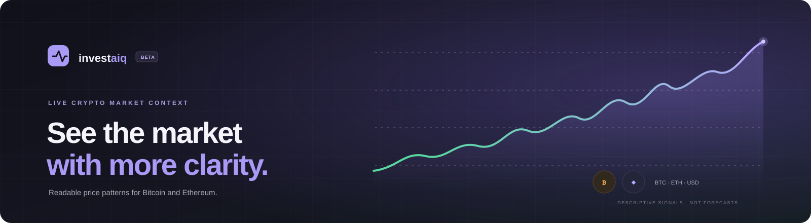
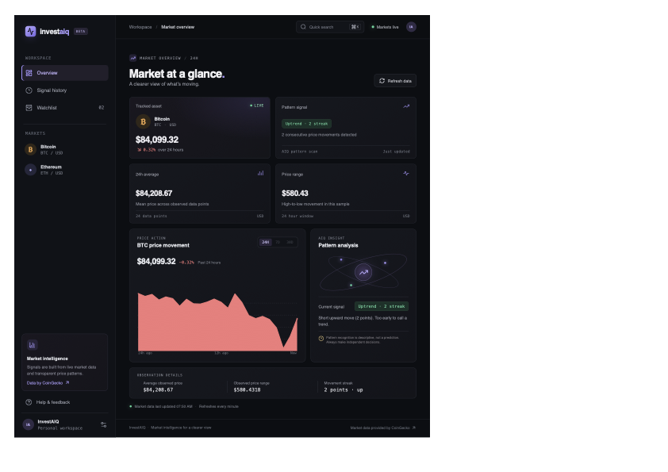

<div align="center">
  
</div>

<div align="center">

### Live crypto market context with clear, explainable pattern signals.

[Explore the code](https://github.com/ShuklaAshutosh1/InvestAIQ) · [Open an issue](https://github.com/ShuklaAshutosh1/InvestAIQ/issues)

</div>

---

## 📈 Product preview

<div align="center">
  
</div>

## ✨ What it does

InvestAIQ is a full-stack market intelligence dashboard for exploring Bitcoin and Ethereum price movement. It turns a live price series into a readable 24-hour chart, descriptive movement signals, and a persistent signal history.

- **Live market snapshots** for BTC and ETH from the CoinGecko public API
- **Price visualization** with a responsive chart, current quote, and observed movement
- **Transparent signal analysis** for consecutive upward, downward, or flat movement
- **Market statistics** including average price, observed range, and streak length
- **Signal history** stored in SQLite and available through the app API
- **Responsive interface** built for desktop and mobile screens

## 🧭 How a snapshot is produced

```text
CoinGecko 24-hour price series
              ↓
       Pattern detector
              ↓
  Snapshot + market statistics
       ↙              ↘
 React dashboard      SQLite history
```

Pattern messages describe recently observed prices. They are not forecasts or investment recommendations.

## 🛠️ Technology

| Layer | Tools |
| --- | --- |
| Frontend | React, TypeScript, Vite, React Router |
| Backend | Node.js 22+, Express |
| Persistence | SQLite through Node's built-in `node:sqlite` |
| Market data | CoinGecko public API |
| Charts | Responsive SVG |

## 🚀 Run locally

**Requirements:** Node.js 22 or newer, npm, and network access to CoinGecko.

```bash
npm install
npm run dev
```

The combined app is served at `http://127.0.0.1:4173`. For a production build:

```bash
npm run build
npm start
```

Set `PORT` to change the HTTP port and `HOST` to change the bind address. The default bind address is `127.0.0.1`.

## 🔌 API

| Method | Route | Purpose |
| --- | --- | --- |
| `GET` | `/api/health` | API health and server timestamp |
| `GET` | `/api/snapshot/BTC` | Fetch, analyze, and record a Bitcoin snapshot |
| `GET` | `/api/snapshot/ETH` | Fetch, analyze, and record an Ethereum snapshot |
| `GET` | `/api/history/BTC?limit=20` | Read recent Bitcoin pattern records |
| `GET` | `/api/history/ETH?limit=20` | Read recent Ethereum pattern records |

## 🗂️ Project structure

```text
src/
  components/   Shared navigation, chart, stats, and history UI
  domain/       Pure pattern-detection and statistics functions
  lib/          Frontend API client
  pages/        Landing, dashboard, and history pages
  styles.css    Responsive visual system
server/
  api.ts             Express routes
  database.ts        SQLite schema and connection
  index.ts           HTTP server and static frontend serving
  marketService.ts   CoinGecko integration and persistence
```

## 🔒 Data and deployment notes

- CoinGecko rate limits and upstream availability can affect live snapshots.
- SQLite history is local to the server. Use persistent disk when deploying if history must survive restarts.
- The current app has no accounts or per-user portfolios; history is shared by one app instance.
- For a public deployment, put the service behind HTTPS and a reverse proxy, and add authentication, rate limiting, monitoring, and database backups before using it as a multi-user product.

## 📄 License

No license file is currently included. All rights remain with the repository owner until a license is added.
